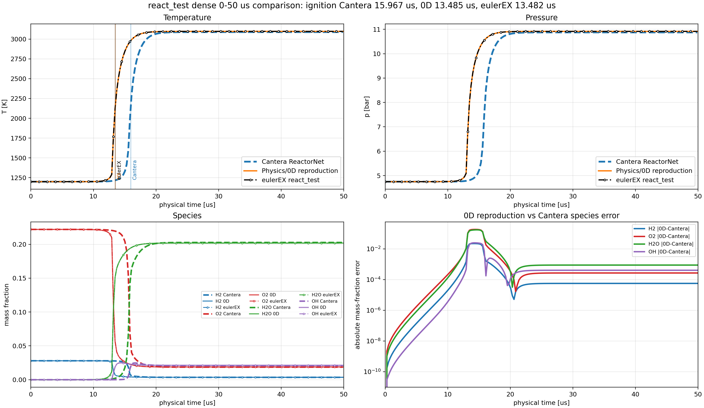

# `react_test.json` 0D Reactive Trajectory Comparison

Numerical code commit used for the recorded results: `d2df97c32db7866a49ca13b7fa385806763126c0`.
The report, dense case, and plotting script were committed later, so reproduce
from a checkout that contains those artifacts.

This note records how the 0D reactive trajectory in `cases/eulerEX/react_test.json`
was compared against a direct Cantera constant-volume reactor and an actual
`eulerEX` solver run.

## Inputs

- Case: `cases/eulerEX/react_test.json`
- Mechanism: `h2o2.yaml`
- Initial conserved state: `eulerSettings.farFieldStaticValue`
- Initial composition: `Y_H2 = 0.028`, `Y_O2 = 0.222`, dependent `Y_N2 = 0.75`
- Reference velocity: `U0 = 379 m/s`
- Reference density: `rho0 = 1 kg/m^3`
- Dense run timestep: `dt_code = 1e-4`, so `dt_phys = dt_code / U0 = 2.638522427e-7 s`
- Dense output: every solver step, through `190` steps (`50.13192612 us`)

## How The Curves Were Obtained

### Cantera ReactorNet

The standalone app `canteraConstVolTrajectory` reads the case, reconstructs the
initial physical state, and runs Cantera directly:

```bash
DNDS_MECH_PATH=external/cfd_externals/install/data \
CANTERA_DATA=external/cfd_externals/install/data \
build/app/canteraConstVolTrajectory.exe \
  workspace/react_test_dense_50us.json \
  workspace/react_test_dense_50us_cantera_phys_history.csv
```

The Cantera branch initializes `IdealGasReactor` with:

- `T = T_DNDSR_initial`
- `rho = rho0 * rho_code`
- the same mass fractions as `farFieldStaticValue`

It advances `Cantera::ReactorNet` to each requested physical output time and
records `T`, `p`, and species mass fractions.

### Physics/0D Reproduction

The same app also reproduces DNDSR's local 0D implicit chemistry update. It
holds the fluid columns fixed (`rho`, momentum, `rhoE`) and advances transported
species densities using:

- `ChemicalSource::productionRates()`
- `ChemicalSource::productionRatesAndJacobian()`
- the same source scaling used by production: `omega_k * MW_k / S0`, with
  `S0 = rho0 * U0 / L0`
- `PhysicsProperties::temperature()` for DNDSR-to-Cantera temperature recovery

This gives the orange `Physics/0D reproduction` curve in the plot.

### Actual `eulerEX`

The actual solver comparison used a dense variant of `react_test.json` with:

- `nTimeStep = 190`
- `nDataOut = 1`
- VTK output enabled and Tecplot output disabled
- `outPltName = ../workspace/eulerEX_dense_50us/react_`

The solver was run from `build/`:

```bash
(cd build && \
  DNDS_MECH_PATH=../external/cfd_externals/install/data \
  CANTERA_DATA=../external/cfd_externals/install/data \
  ./app/eulerEX.exe 14 ../workspace/react_test_dense_50us.json)
```

The parser reads the `workspace/eulerEX_dense_50us/react__*.vtu` series selected
by explicit output prefix. If the output directory contains exactly one run, the
prefix can be inferred; otherwise pass `--prefix react__...`.
For each file it extracts and cell-averages:

- `FieldData/TIME` as code time
- `CellData/T` as temperature
- `CellData/P` multiplied by `U0^2` as physical pressure in Pa
- `CellData/V1..V9` as transported species mass fractions
- `Y_N2 = 1 - sum(V1..V9)`

The parsed solver history is saved as
`workspace/react_test_dense_50us_eulerEX_history.csv`.

## Figure



The figure shows the first `50 us` of physical time. The line styles are:

- Blue dashed: direct Cantera `IdealGasReactor` / `ReactorNet`
- Orange solid: DNDSR Physics/0D reproduction
- Green solid line with dot markers: actual `eulerEX` run using the dense case

## Results

Ignition time is measured using a midpoint-temperature threshold:

`T_threshold = T_initial + 0.5 * (T_final,Cantera - T_initial) = 2143.909070906765 K`

| Trajectory | Ignition time |
| --- | ---: |
| Cantera ReactorNet | `15.966798430 us` |
| Physics/0D reproduction | `13.485060156 us` |
| Actual `eulerEX` | `13.482403340 us` |

Key observations:

- The actual `eulerEX` run and the Physics/0D reproduction are nearly
  indistinguishable on temperature and pressure, confirming that the local 0D
  reproduction tracks the solver's source integration path.
- Both DNDSR curves ignite about `2.48 us` earlier than direct Cantera for this
  dense run.
- After ignition, the DNDSR and Cantera states settle close to each other. The
  standalone app reported final relative errors of approximately `2.93e-3` for
  temperature and `3.82e-3` for pressure, with final max species mass-fraction
  error about `8.76e-4`.
- The largest raw curve mismatch occurs during the steep ignition front, where a
  small ignition-time shift produces a large instantaneous temperature/species
  difference.

## Reproduction Commands

Build the tools:

```bash
cmake --build build -t eulerEX canteraConstVolTrajectory -j32
```

Generate the dense Cantera/Physics trajectory:

```bash
DNDS_MECH_PATH=external/cfd_externals/install/data \
CANTERA_DATA=external/cfd_externals/install/data \
build/app/canteraConstVolTrajectory.exe \
  workspace/react_test_dense_50us.json \
  workspace/react_test_dense_50us_cantera_phys_history.csv
```

Run the dense solver case:

```bash
(cd build && \
  DNDS_MECH_PATH=../external/cfd_externals/install/data \
  CANTERA_DATA=../external/cfd_externals/install/data \
  ./app/eulerEX.exe 14 ../workspace/react_test_dense_50us.json)
```

Regenerate the plot:

```bash
python workspace/plot_react_test_dense_50us_three.py --prefix react__YYYYMMDD_HHMMSS
```

Omit `--prefix` only when `workspace/eulerEX_dense_50us/` contains exactly one
`react__*.log` run. The script writes the regenerated plot to
`workspace/react_test_dense_50us_compare.png`; it does not overwrite the
committed figure under `docs/dev/reactiveFlow/`.
