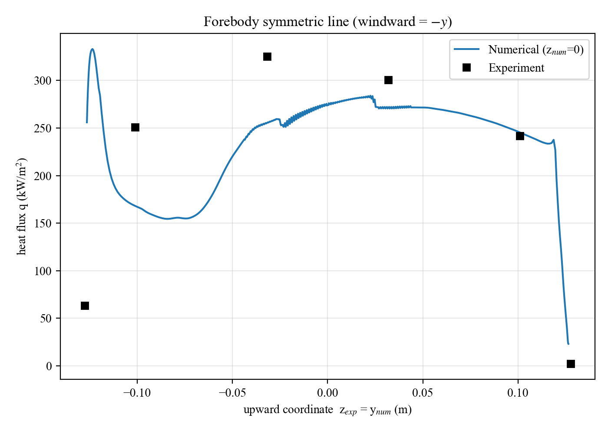
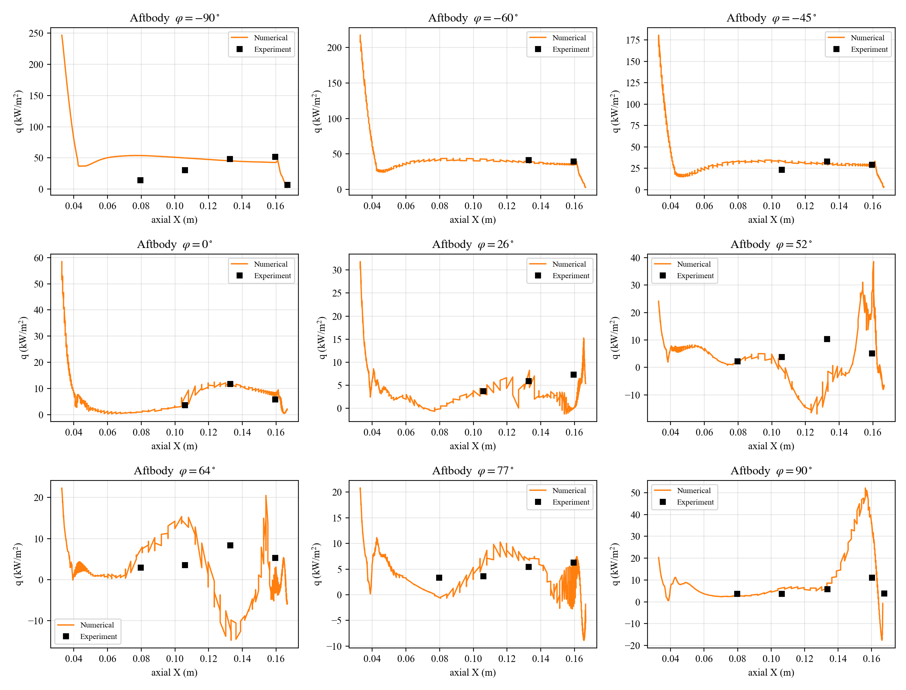
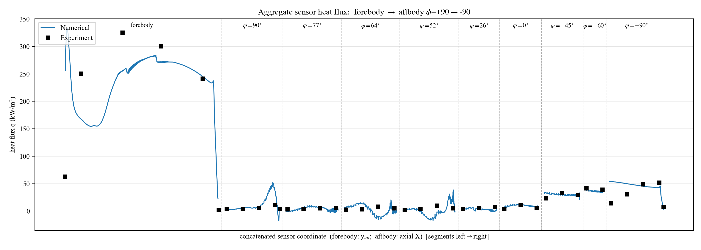
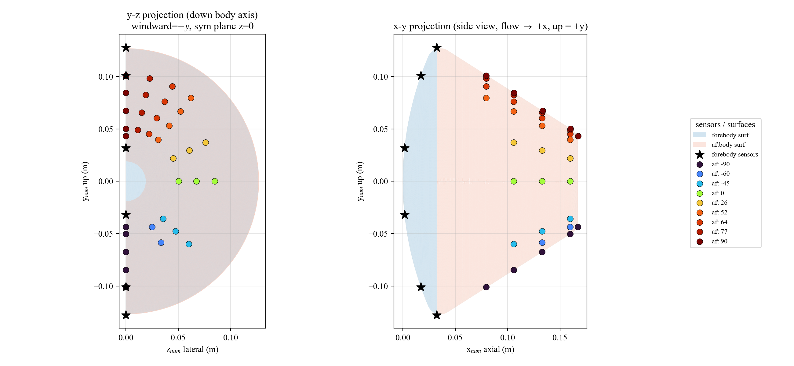
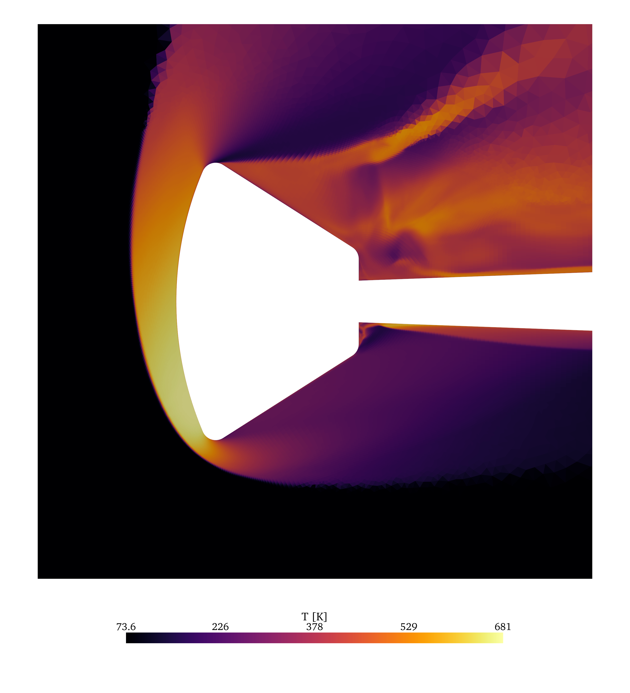
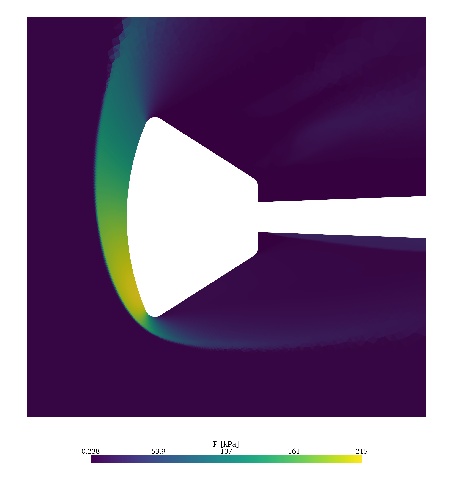

# Orion Capsule Reentry — Heat-Flux Post-Processing

Comparison of numerical wall heat flux (Compact Finite Volume SA-RANS solver)
against wind-tunnel heat-transfer measurements for a 10-inch Orion capsule
model, plus symmetry-plane flow visualization.

## Case setup

| Quantity | Value |
|---|---|
| Model | Orion capsule, 10-in (D = 0.254 m, R = 0.127 m) |
| Mach number | 6.41 |
| Angle of attack | 28 deg (pitch, sideslip 0) |
| Reynolds number | 1.077e7 (ref. length D = 0.254 m); unit Re = 4.24e7 /m |
| Static temperature | 73.63 K |
| Wall temperature | 295.56 K (isothermal wall) |
| Static pressure | 4068.26 Pa |
| Turbulence model | Spalart–Allmaras (eulerSA3D) |
| Mesh | half model, symmetry plane z = 0; **8,857,647** volume cells (hex-dominant: ~85% hex, ~14.5% tet, ~0.6% pyramid); 216,498 boundary faces |

Experimental data: `../../data/recv/Orion/Experimental/` (heat flux in W/m^2).
Numerical boundary file: `../../data/recv/Orion/redraw_run0/out-restart1-restart1-rot-rm8-cw-backin__1_20000_bnd.vtkhdf` (`F4` = wall energy-flux density).

Scripts: [`orion_postproc.py`](orion_postproc.py) (sensor-line comparison,
matplotlib) and [`orion_contour.py`](orion_contour.py) (symmetry-plane
renders, pyvista).

## Coordinate conventions

- **Experimental (American, left-hand):** x = axial (toward back), y = lateral, z = upward.
- **Numerical (right-hand, body-axial):** x = axial, y = up, z = lateral.
- Mapping: `y_exp (lateral) -> z_num`, `z_exp (up) -> y_num`.
- Body axis = x; freestream in the output frame = (cos28, sin28, 0), so the
  **windward side is -y**.
- Azimuth about the body axis: `phi = atan2(y_num, z_num)`; `phi = 0` is the
  lateral side (+z), `phi = -90` is windward (-y), `phi = +90` is leeward (+y).
- Visualization uses numerical coordinates scaled to the physical model:
  `x_phys = x_num * 0.0254 m` (geometry is D = 10 nondim).

## Heat-flux unit conversion

The solver is normalized with rho = 1, u = 1. `F4` is the wall energy-flux
**density** (`fluxBnd = fluxEs / faceArea`), reported **outward from the
fluid**, so heat into the wall is positive after a sign flip:

```
q [W/m^2] = -F4 * rho_ref * u_ref^3 = -F4 * 2.580e8
```

with `rho_ref = p_inf/(R*T_inf) = 0.1925 kg/m^3` and
`u_ref = Ma*sqrt(gamma*R*T_inf) = 1102.5 m/s`. No length factor enters (the
mesh-scaling cancels between viscosity and the temperature gradient). The
conversion is independently confirmed by reproducing the unit Reynolds number
(4.24e7 /m).

Boundary patches used for extraction: **FaceZone 24 = forebody**,
**FaceZone 25 = aftbody**, **FaceZone 22 = symmetry plane (z = 0)**.

## Figures

### Forebody symmetric line



Heat flux along the forebody symmetric meridian (`z_num = 0`), plotted versus
the upward coordinate `z_exp = y_num`. Numerical line vs experimental points;
windward edge is at -y.

### Aftbody meridian lines



Aftbody heat flux versus axial coordinate X for each measured azimuth
`phi = -90 ... +90 deg`. Numerical lines are extracted on the constant-azimuth
meridian (±2.5 deg band) with the flat base cap excluded (faces with
`|n_x| > 0.97` dropped) so `q(x)` stays single-valued near the base.

### Aggregate sensor comparison



All sensor lines concatenated on one axis in the order
forebody -> aftbody phi = +90 -> -90, numerical vs experiment. Useful for an
at-a-glance overall agreement check; windward angles (phi -> -90) are the
hottest in both data sets.

### Sensor position projections (coordinate debug)



Projection of all sensor positions onto the y-z plane (looking down the body
axis) and the x-y plane (side view), overlaid on the real forebody/aftbody
wall surfaces (FaceZone 24/25). Aftbody markers are placed at the exact
azimuth `phi` with the side-facing surface radius (base cap excluded) so they
lie on the conical wall, not the rear cap. Used to verify the
experiment-to-numerical coordinate mapping.

### Symmetry-plane temperature



Temperature field on the z = 0 symmetry plane (FaceZone 22), window
`x in [-0.5D, 1.5D]`, `y in [-1D, 1D]`. Flow -> +x, windward = -y. The bow
shock and post-shock stagnation region (T ~ 680 K, matching the theoretical
stagnation temperature) are visible ahead of the windward heat shield.

### Symmetry-plane pressure



Pressure field on the same symmetry plane and window. Peak ~215 kPa behind the
normal portion of the bow shock (consistent with the Mach-6.41 pitot
estimate).

### Symmetry-plane mesh


The symmetry-plane grid (real quad/tri cells, rendered unclipped to preserve
cell topology), showing near-body refinement and the boundary-layer clustering.

## Notes

- Plots use a Times-family serif font; pyvista renders are supersampled
  (`IMG_SCALE = 3`, ~3000 px) and matplotlib figures use `dpi = 200`.
- Convention toggles (`FORE_YEXP_SIGN`, `AZI_SIGN`) and tolerances live at the
  top of `orion_postproc.py`; the data supports the current choice
  (windward `phi = -90` is hottest in both numerical and experimental sets).
- Run the renders headless with `EGL_PLATFORM=surfaceless`.
