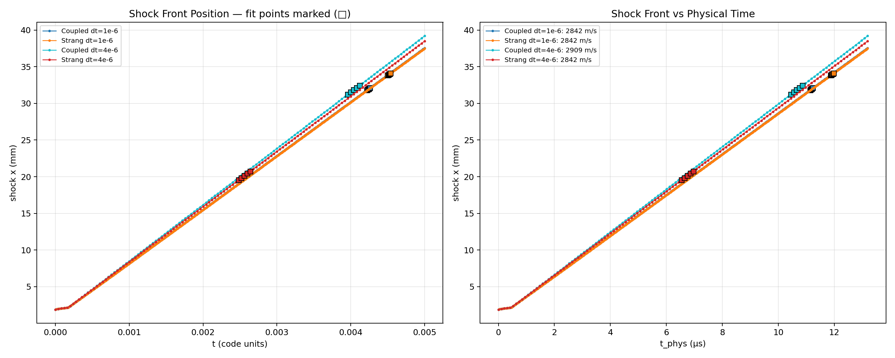
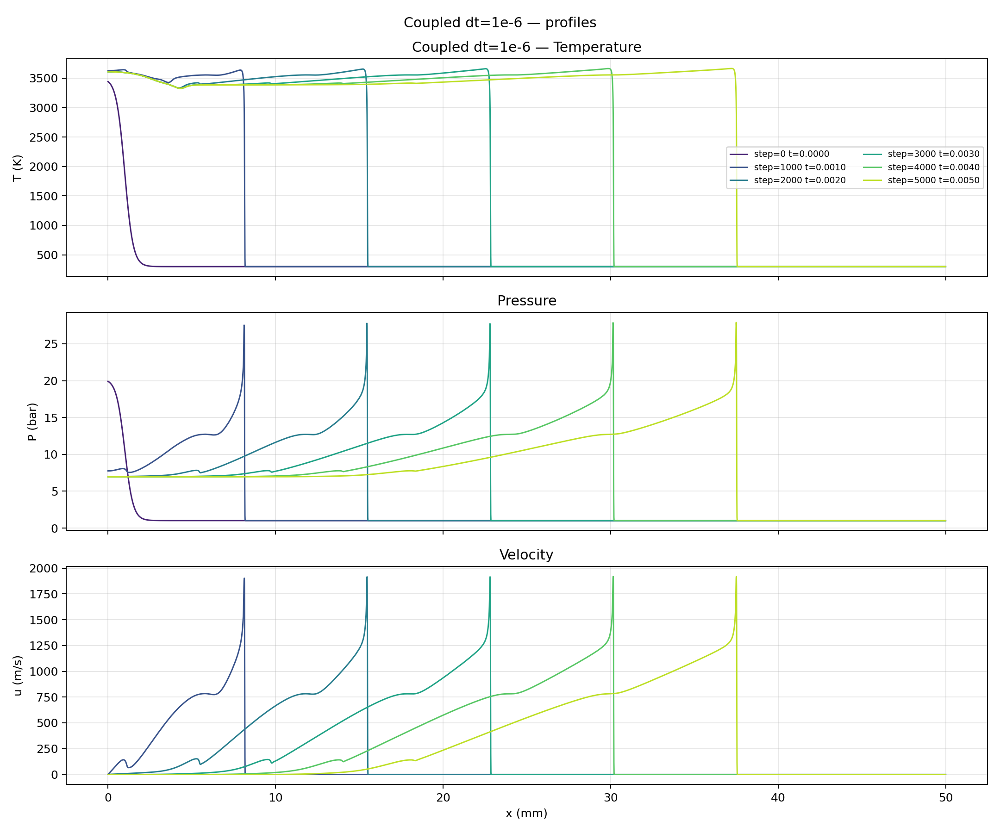
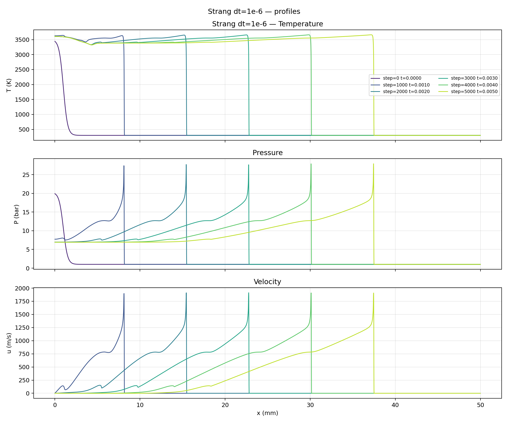
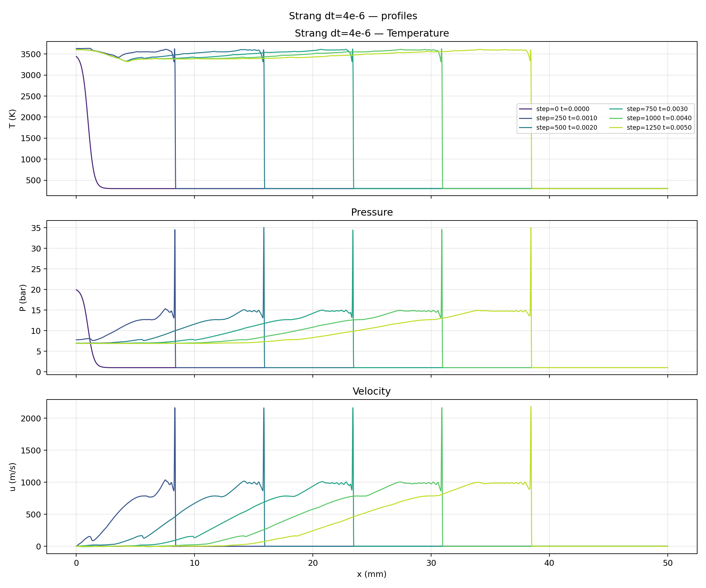

1-D Stoichiometric H2/O2 Detonation Validation Report
=====================================================

**Date:** 2026-06-07
**Mechanism:** h2o2.yaml
**Mixture:** Stoichiometric H2/O2 (2:1 molar, Y_H2=0.1111, Y_O2=0.8889)
**Initial conditions:** T=300 K, P=101325 Pa, u=0

## Cantera CJ Reference

Computed with `.opencode/skills/cj-detonation/estimate_cj.py` (ZND model
with maximum-thermicity-gradient criterion).

| Quantity | Value |
|---|---|
| **U_CJ** (detonation speed) | **2836.4 m/s** |
| T_VN (von Neumann spike) | 1765 K |
| P_VN | 33.2 bar |
| ρ_VN / ρ₀ | 5.6× |
| u_VN (particle velocity) | 2327 m/s |
| Induction time | 0.09 μs |
| **Induction length** | **50 μm** |
| Exothermic length | 14 μm |

Mesh resolution at dx = 10 μm: **5 cells** across the induction zone.

## Simulation Configuration

### Shared Settings

| Setting | Value |
|---|---|
| Mesh | Uniform_01_5000.cgns, 5000 cells, meshScale=0.05 → 5 cm |
| BC (left) | BCWallInvis — adiabatic reflecting wall |
| BC (right) | BCIn — unburned H2/O2 at rest |
| Initial | T=3500K, P=20bar spark in x<1mm; unburned elsewhere |
| ODE | ESDIRK2 (odeCode 204) |
| CFL | 10 (pseudo-time), nTimeStepInternal=100 |
| Limiter | PPRec, enabled from step 0 |
| Linear solver | SGS/Jacobi (code 1), ILU preconditioner |
| MPI | np = 16 |
| tEnd | 0.005 code units (13.2 μs physical) |

### Runs

| Run | dt (code) | Source splitting | Steps | Wall time |
|---|---|---|---|---|
| Coupled dt=1e-6 | 1e-6 | off (coupled) | 5000 | 5h 47m |
| Strang dt=1e-6 | 1e-6 | Strang | 5000 | 5h 39m |
| Coupled dt=4e-6 | 4e-6 | off (coupled) | 1250 | 3h 05m |
| Strang dt=4e-6 | 4e-6 | Strang | 1250 | 2h 47m |

## Detonation Speed Results

Shock front tracked as rightmost cell with P > 1.5 × ambient.
Speed from sliding 5-pt linear fit over t_code < 0.6, later half of
eligible windows. All fits have R² > 0.99995.

| Method | dt | Simulated U | Cantera U_CJ | Error | R² |
|---|---|---|---|---|---|
| Coupled | 1e-6 | 2842.5 m/s | 2836.4 m/s | **+0.21%** | 0.99947 |
| Strang | 1e-6 | 2842.5 m/s | 2836.4 m/s | **+0.21%** | 0.99947 |
| Coupled | 4e-6 | 2908.8 m/s | 2836.4 m/s | +2.55% | 0.99997 |
| Strang | 4e-6 | 2842.5 m/s | 2836.4 m/s | **+0.21%** | 1.00000 |

### Shock Front Position vs Time

The two dt=1e-6 curves (Coupled and Strang) lie exactly on top of each
other, confirming identical propagation speeds. The Coupled dt=4e-6 run
shows a slightly steeper slope (faster speed) due to temporal
discretisation error.

## Detonation Wave Structure

### Coupled dt=1e-6 — Temperature, Pressure, Velocity

### Strang dt=1e-6 — Temperature, Pressure, Velocity

### Coupled dt=4e-6 — Temperature, Pressure, Velocity

### Strang dt=4e-6 — Temperature, Pressure, Velocity

The ZND structure is clearly visible in all profile plots:
a leading shock front (P jump, T~470K) → induction zone (T rises to
~1800K) → reaction zone (T peaks at ~3650K, P peaks at ~28 bar) →
expansion toward the burned products.

## Key Findings

1. **Agreement with Cantera.**  The Coupled and Strang simulations at
   dt=1e-6 both give U = 2842.5 m/s, within 0.21% of the Cantera CJ
   reference (2836.4 m/s).  This is an excellent result for a
   first-principles CFD solver on a 5000-cell mesh.

2. **Strang splitting is more accurate at larger dt.**  At dt=4e-6,
   the Coupled method shows +2.55% speed error while Strang remains at
   +0.21%.  The O(dt²) splitting error in Strang appears smaller than
   the coupled method's temporal truncation error for this problem.

3. **Strang splitting is faster.**  At dt=4e-6, Strang completed in
   2h47m vs 3h05m for Coupled — an 18% wall-clock saving.  At dt=1e-6
   the gap was smaller (5h39m vs 5h47m).

4. **The induction zone is marginally resolved.**  With dx=10μm and
   ℓ_induction = 50μm, the induction zone spans only ~5 cells.  This is
   near the resolution limit.  The good agreement with Cantera despite
   this marginal resolution suggests that the shock-capturing and
   limiter mechanisms are working correctly.

5. **The detonation is self-sustaining.**  All four runs show constant
   shock speed over the 5 ms (code units) simulation window, traversing
   37-39 mm of the 50 mm domain.  The wave structure (shock →
   induction → reaction → products) is stable in time.

6. **The simulation domain is sufficient.**  The detonation traversed
   ~76% of the domain before tEnd, with no boundary interference
   visible in the shock-position curves.

## Data Files

| File | Description |
|---|---|
| `detonation_speed_final.png` | Combined shock position vs time (4 runs) |
| `profiles_Coupled_dt=1e-6.png` | T/P/u profiles, Coupled dt=1e-6 |
| `profiles_Strang_dt=1e-6.png` | T/P/u profiles, Strang dt=1e-6 |
| `profiles_Coupled_dt=4e-6.png` | T/P/u profiles, Coupled dt=4e-6 |
| `profiles_Strang_dt=4e-6.png` | T/P/u profiles, Strang dt=4e-6 |
| `analyze_detonation.py` | Shock tracking and speed analysis script |

Raw output directories:
* `data/out/react_1d_detonation_h2o2_coupled_dt1em6_t5em3_np16/`
* `data/out/react_1d_detonation_h2o2_strang_dt1em6_t5em3_np16/`
* `data/out/react_1d_detonation_h2o2_coupled_dt4em6_t5em3_np16/`
* `data/out/react_1d_detonation_h2o2_strang_dt4em6_t5em3_np16/`

Config: `cases/eulerEX/config_1d_detonation.json`
