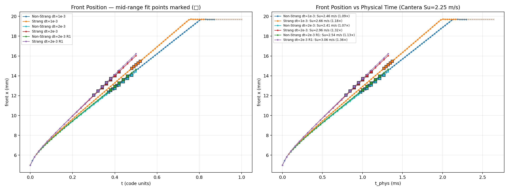
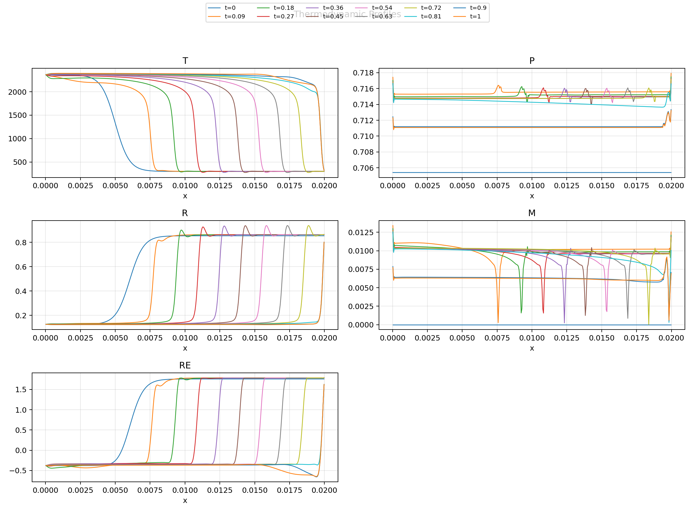
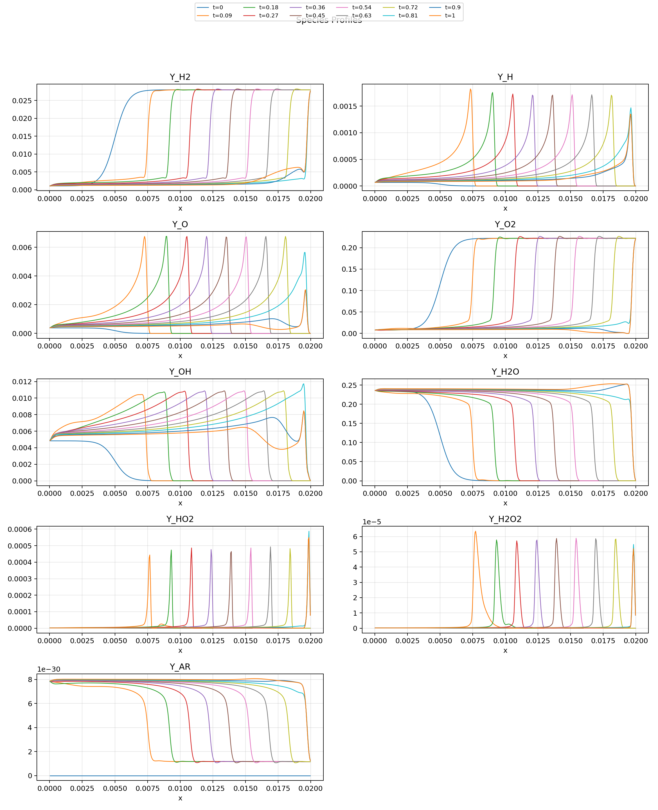
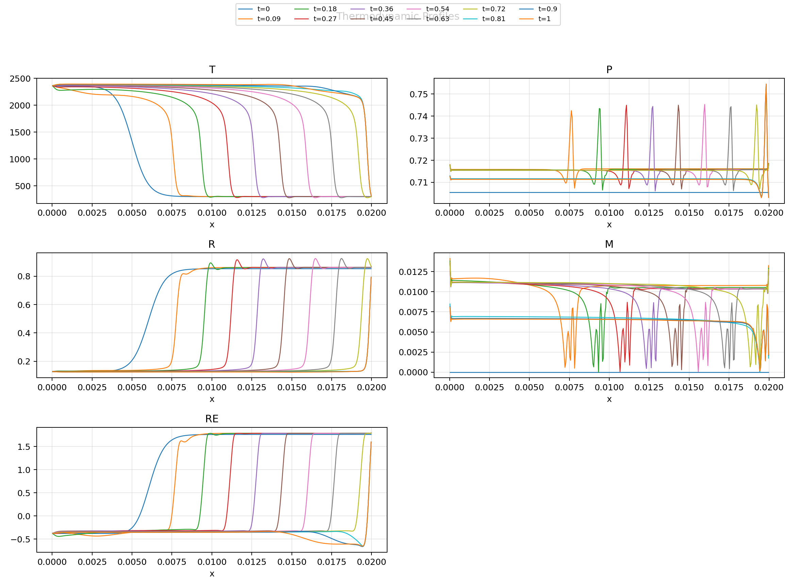
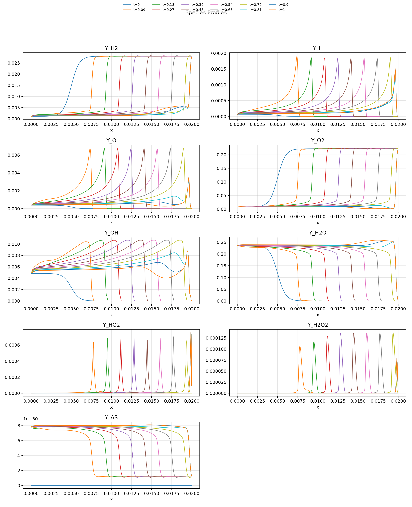
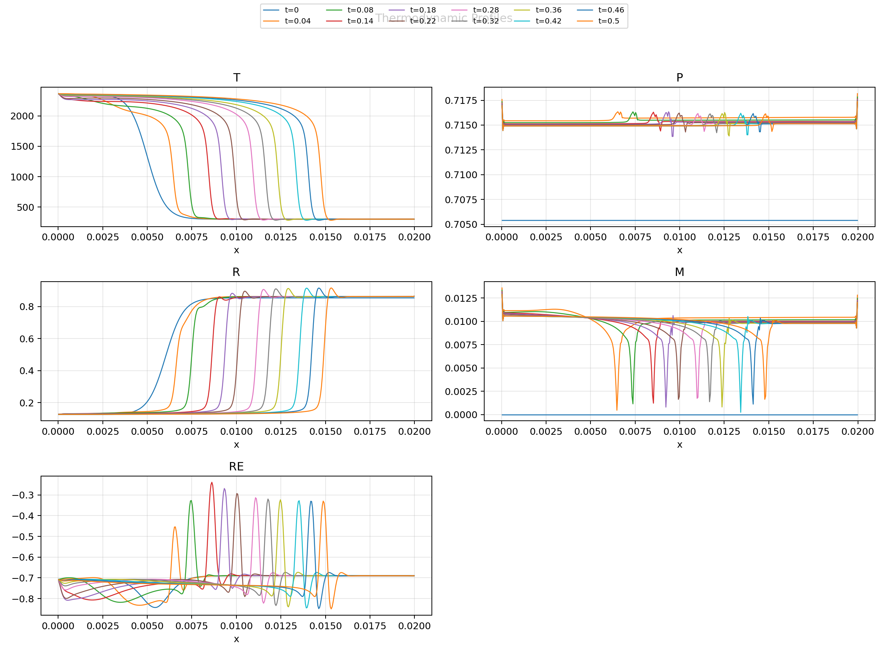
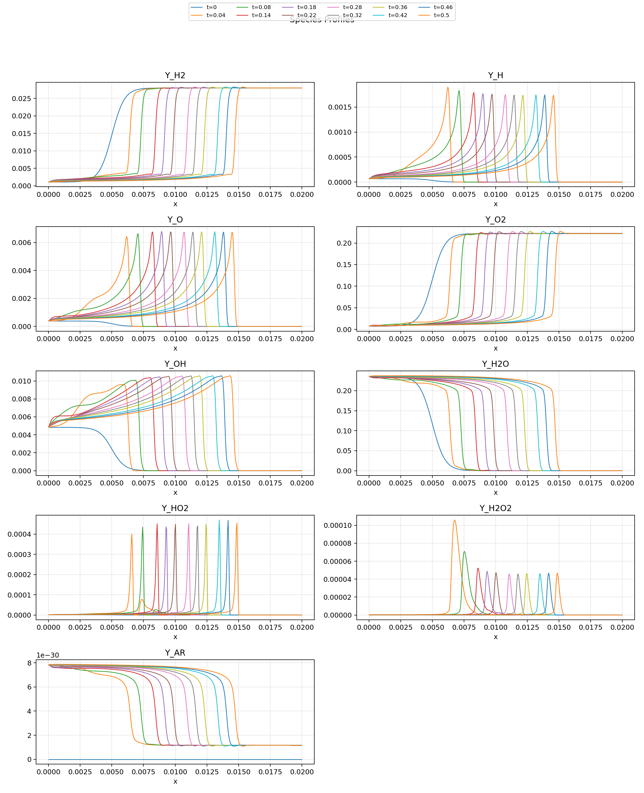
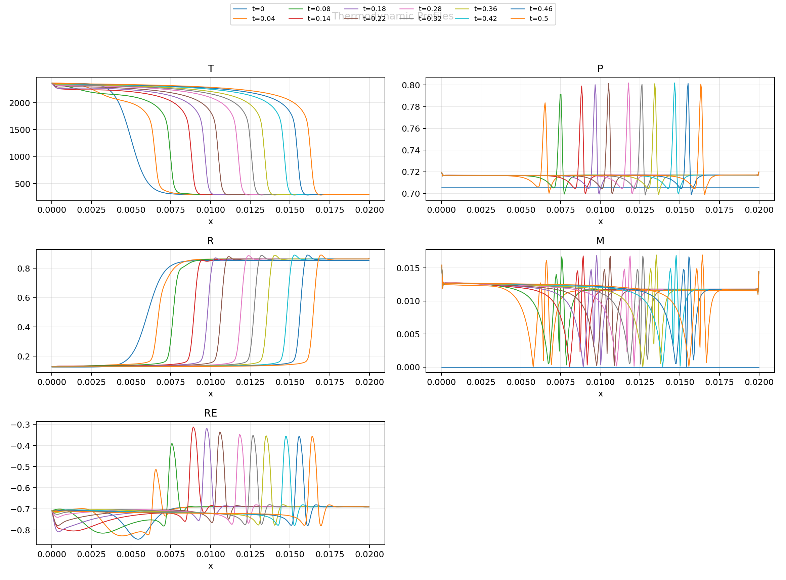
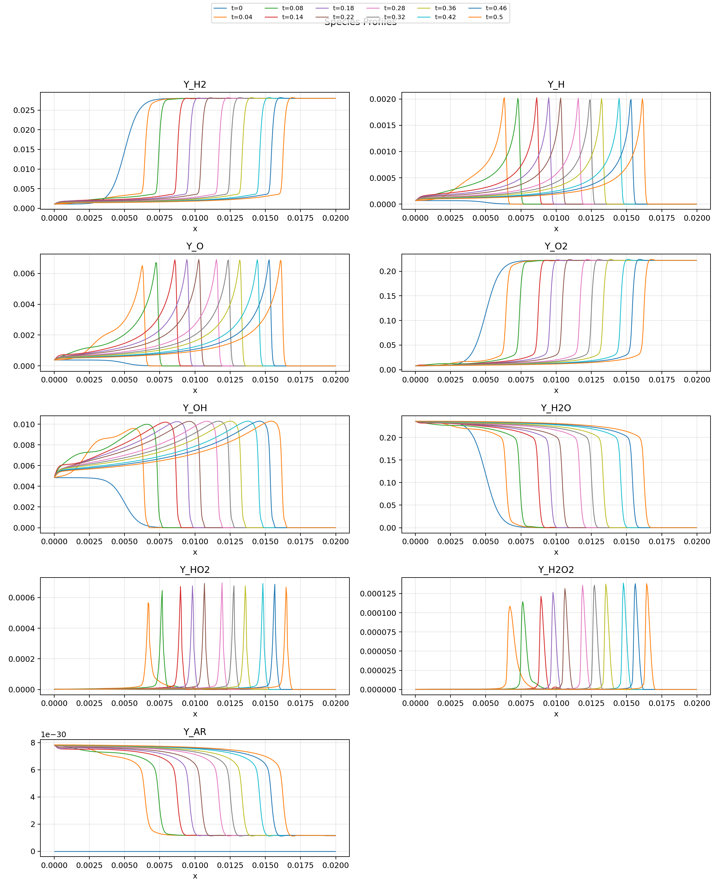

Strang vs Non-Strang Premixed Flame Comparison
===============================================

Cantera reference: `scripts/reaction/h2o2_free_flame_mixture_averaged.py`,
h2o2.yaml stoichiometric H2/air, mixture-averaged transport, no Soret
(matching DNDSR transport).  T_u = 300 K, p = 101325 Pa,
Su = 2.2540 m/s, burned T = 2360.02 K, rho_u/rho_b = 6.77.

Shared Configuration
--------------------

* Mesh: Uniform_01_400.cgns, 400 quad cells, meshScale = 0.02 → 2 cm domain
* BC: BCIn both sides — burned on left, unburned on right, zero velocity
* Initial: tanh profile centred at x = 0.005 m, width 1 mm
* ODE: ESDIRK2 (odeCode = 204), CFL = 10 (pseudo-time only)
* Pseudo-time: nTimeStepInternal = 200, rhsThreshold = 1e-3
* Limiter: PPRec, nPartialLimiterStart = 1e6 (off)
* Linear solver: SGS/Jacobi (jacobiCode = 1), ILU direct preconditioner
* Reactive source scale = 1, species diffusion enabled
* MPI: np = 8
* Output: every 10 steps

Differs by
----------

| Setting                | Strang          | Non-Strang      |
|------------------------|-----------------|-----------------|
| sourceStrangSplitting  | 1               | 0               |
| Reactive source in RHS | off (flow-only) | on (fully coupled) |
| Chemistry integration  | Cantera CVODE   | point-implicit pseudo-time |

Front Marker vs Time
--------------------

Marker positions for all 6 runs.  Solid lines + circles = free-propagation
phase; faint x-markers = pinned-at-boundary tail.  Mid-range 5-pt fit
windows for Su derivation are marked with squares (□).

Flame Speed
-----------

Front: x where T = T_mid = 0.5 × (300 + 2360.02) = 1330.01 K.

Marker speed from a sliding 5-pt linear fit over the later half of
points with t_code < 0.6 (all R² > 0.99998).

Su = marker_speed − u_gas(unburned ahead of flame).

### dt = 1e-3 (1000 physical steps, tEnd = 1.0)

|                          | Non-Strang    | Strang        |
|--------------------------|---------------|---------------|
| Marker speed (sliding)   | 6.37 m/s      | 6.88 m/s      |
| u_unburned               | 3.91 m/s      | 4.22 m/s      |
| **Derived Su**           | **2.46 m/s**  | **2.66 m/s**  |
| Ratio vs Cantera         | 1.09×         | 1.18×         |
| R²                       | 0.999999      | 1.000000      |

### dt = 2e-3 (500 physical steps, tEnd = 0.5)

|                          | Non-Strang    | Strang        | Non-Strang R1 | Strang R1     |
|--------------------------|---------------|---------------|---------------|---------------|
| Marker speed (sliding)   | 6.25 m/s      | 7.66 m/s      | 6.53 m/s      | 7.86 m/s      |
| u_unburned               | 3.83 m/s      | 4.70 m/s      | 4.00 m/s      | 4.81 m/s      |
| **Derived Su**           | **2.41 m/s**  | **2.97 m/s**  | **2.54 m/s**  | **3.06 m/s**  |
| Ratio vs Cantera         | 1.07×         | 1.32×         | 1.13×         | 1.36×         |
| R²                       | 1.000000      | 1.000000      | 1.000000      | 1.000000      |

### Summary

| Method       | dt   | Su        | R²       | vs Cantera |
|--------------|------|-----------|----------|------------|
| Non-Strang   | 1e-3 | 2.46 m/s  | 0.999999 | 1.09×      |
| Non-Strang   | 2e-3 | 2.41 m/s  | 1.000000 | 1.07×      |
| Non-Strang R1| 2e-3 | 2.54 m/s  | 1.000000 | 1.13×      |
| Strang       | 1e-3 | 2.66 m/s  | 1.000000 | 1.18×      |
| Strang       | 2e-3 | 2.97 m/s  | 1.000000 | 1.32×      |
| Strang R1    | 2e-3 | 3.06 m/s  | 1.000000 | 1.36×      |

Profiles
--------

### dt = 1e-3 — Non-Strang (coupled)

### dt = 1e-3 — Strang

### dt = 2e-3 R1 — Non-Strang

### dt = 2e-3 R1 — Strang

Key Observations
----------------

1. **Non-Strang coupled agrees with Cantera to within 7–13 %** across
   all runs.  This is excellent for a 400-cell mesh at dx = 0.05 mm.

2. **Strang splitting systematically over-predicts Su** by 18–36 %.
   Error grows with dt (splitting error is O(dt²)).

3. **Non-Strang shows no consistent degradation with dt** over this
   range (2.46 → 2.41 → 2.54 m/s).  Temporal truncation error is below
   other error sources.

4. **R1 repeat runs are consistent** — Non-Strang R1 (2.54 m/s, 1.13×)
   and Strang R1 (3.06 m/s, 1.36×) are close to the first set.

5. **The 2 cm domain is too short.**  All flames hit the right BCIn
   boundary.  The sliding-window fit uses t_code < 0.6 to avoid
   boundary influence.

6. **BCIn on both ends creates a non-free-flame flow field.**  Su must
   be derived as marker_speed − u_unburned.

Plots and Data
--------------

* `front_marker_time.png` — combined front position vs time (all 6 runs)
* `analyze_flame_speed.py` — speed analysis + marker plot script
* `plot_output_digest.py` — profile/history digest script
* `nostrang_profiles_thermo.png` / `_species.png` — Non-Strang dt=1e-3
* `strang_profiles_thermo.png` / `_species.png` — Strang dt=1e-3
* `nostrang_dt2e3_R1_profiles_thermo.png` / `_species.png` — Non-Strang dt=2e-3 R1
* `strang_dt2e3_R1_profiles_thermo.png` / `_species.png` — Strang dt=2e-3 R1
* `nostrang_digest.json` / `strang_digest.json` — dt=1e-3 digests
* `nostrang_dt2e3_R1_digest.json` / `strang_dt2e3_R1_digest.json` — dt=2e-3 R1 digests
* `cantera_freeflame_profile.csv` — Cantera FreeFlame solution
* `cantera_reference_summary.json` — authoritative Cantera reference
